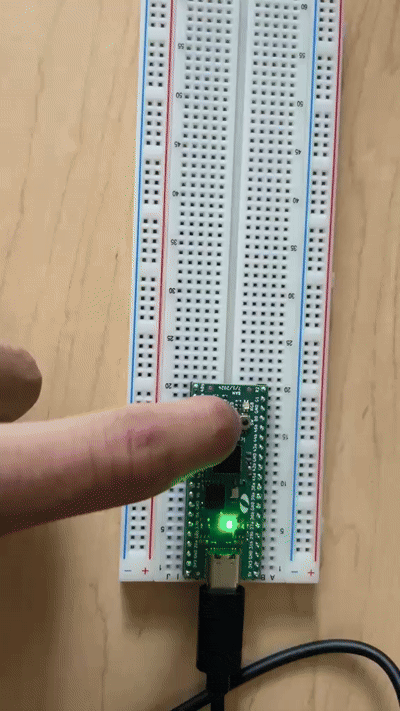

# RGB LED Miniproject

SystemVerilog design for the iceBlinkPico RGB LED. It cycles through red, yellow,
green, cyan, blue, and magenta once per second.

## Demo

Demo GIF:




## Build and Program

```sh
make
make prog
```

